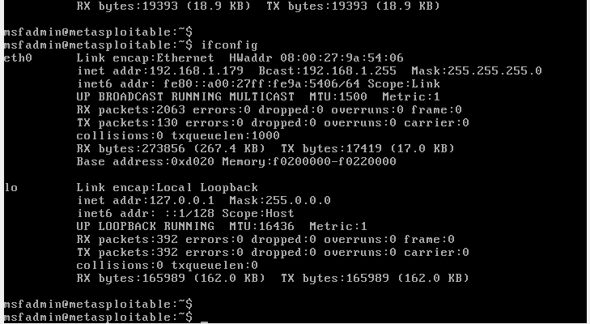
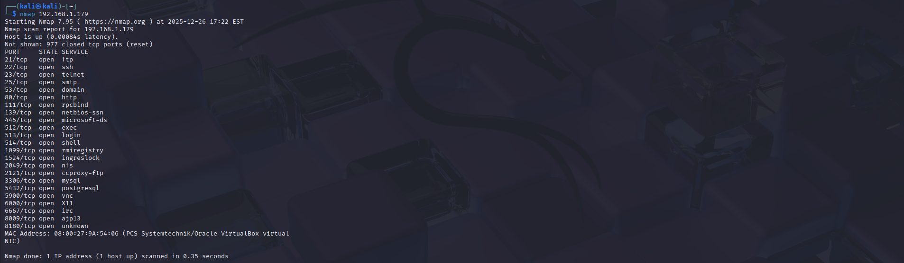

# Nmap Scan Lab – Descubrimiento y Enumeración

## Descripción
Este laboratorio documenta el uso de **Nmap** para realizar descubrimiento de hosts, escaneo de puertos y enumeración básica de servicios en un entorno controlado.

El ejercicio se alinea con tácticas del framework **MITRE ATT&CK**, específicamente en la fase de reconocimiento.

---

## Objetivo
- Identificar hosts activos en una red.
- Detectar puertos abiertos.
- Enumerar servicios y versiones.
- Comprender la importancia del reconocimiento en un análisis de seguridad.

---

## Relación con MITRE ATT&CK

| Táctica | Técnica | ID | Descripción |
|--------|----------|----|-------------|
Reconnaissance | Network Service Discovery | T1046 | Descubrimiento de servicios de red mediante escaneo. |
Reconnaissance | Active Scanning | T1595 | Escaneo activo para recopilar información del objetivo. |

---

## Entorno de laboratorio
- **Atacante:** Kali Linux  
- **Objetivo:** Metasploitable 2  
- **Red:** Laboratorio local en VirtualBox (Host-Only / NAT)  

> Todas las pruebas se realizan en entornos controlados con fines educativos.

---

## Herramienta utilizada
- Nmap

---

## Procedimiento

### 1. Descubrimiento de host
Comando utilizado: ```bash nmap -sn 192.168.1.0/24  ```

---

## Evidencia 

Se detectaron múltiples hosts activos en la red local. Para efectos del laboratorio, se analiza únicamente el host objetivo (Metasploitable) con IP 192.168.1.79.

### Validación del host objetivo

Se valida conectividad con el host identificado como objetivo (Metasploitable 2) en la IP **192.168.1.79** mediante ICMP.

```bash
ping -c 3 192.168.1.79
```

## Evidencia


### Confirmación de IP en el host objetivo (Metasploitable 2)

Se verifica desde el sistema objetivo que la interfaz de red tiene asignada la IP **192.168.1.79**.

## Evidencia



### 2. Escaneo de puertos TCP

Comando utilizado:
```bash
nmap 192.168.1.79
```

## Evidencia

Se identifican varios puertos TCP abiertos en el host objetivo, lo que confirma la exposición de múltiples servicios y valida la continuación del proceso de enumeración.

