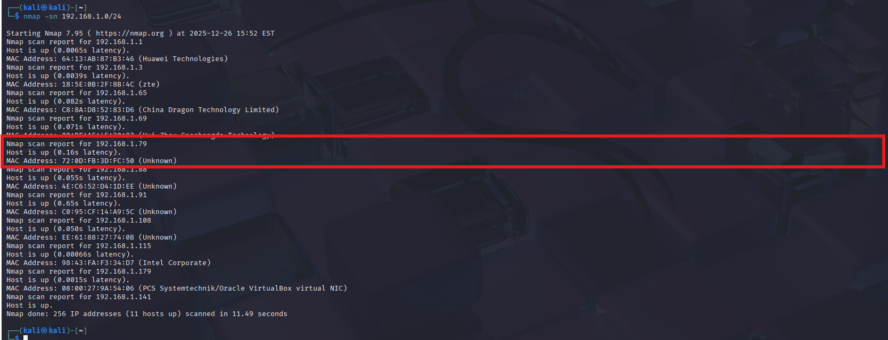

# Nmap Scan Lab – Descubrimiento y Enumeración

## Descripción
Este laboratorio documenta el uso de **Nmap** para realizar descubrimiento de hosts, escaneo de puertos y enumeración básica de servicios en un entorno controlado.

El ejercicio se alinea con tácticas del framework **MITRE ATT&CK**, específicamente en la fase de reconocimiento.

---

## Objetivo
- Identificar hosts activos en una red.
- Detectar puertos abiertos.
- Enumerar servicios y versiones.
- Comprender la importancia del reconocimiento en un análisis de seguridad.

---

## Relación con MITRE ATT&CK

| Táctica | Técnica | ID | Descripción |
|--------|----------|----|-------------|
Reconnaissance | Network Service Discovery | T1046 | Descubrimiento de servicios de red mediante escaneo. |
Reconnaissance | Active Scanning | T1595 | Escaneo activo para recopilar información del objetivo. |

---

## Entorno de laboratorio
- **Atacante:** Kali Linux  
- **Objetivo:** Metasploitable 2  
- **Red:** Laboratorio local en VirtualBox (Host-Only / NAT)  

> Todas las pruebas se realizan en entornos controlados con fines educativos.

---

## Herramienta utilizada
- Nmap

---

## Procedimiento

### 1. Descubrimiento de host
Comando utilizado: ```bash nmap -sn 192.168.1.0/24  ```

---

## Evidencia 
