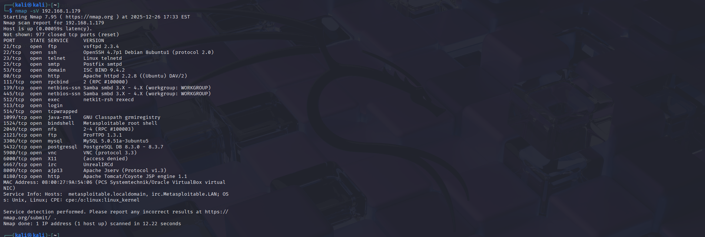

# Nmap Scan Lab – Descubrimiento y Enumeración

## Descripción
Este laboratorio documenta el uso de **Nmap** para realizar descubrimiento de hosts, escaneo de puertos y enumeración básica de servicios en un entorno controlado.

El ejercicio se alinea con tácticas del framework **MITRE ATT&CK**, específicamente en la fase de reconocimiento.

---

## Objetivo
- Identificar hosts activos en una red.
- Detectar puertos abiertos.
- Enumerar servicios y versiones.
- Comprender la importancia del reconocimiento en un análisis de seguridad.

---

## Relación con MITRE ATT&CK

| Táctica | Técnica | ID | Descripción |
|--------|----------|----|-------------|
Reconnaissance | Network Service Discovery | T1046 | Descubrimiento de servicios de red mediante escaneo. |
Reconnaissance | Active Scanning | T1595 | Escaneo activo para recopilar información del objetivo. |

---

## Entorno de laboratorio
- **Atacante:** Kali Linux  
- **Objetivo:** Metasploitable 2  
- **Red:** Laboratorio local en VirtualBox (Host-Only / NAT)  

> Todas las pruebas se realizan en entornos controlados con fines educativos.

---

## Herramienta utilizada
- Nmap

---

## Procedimiento

### 1. Descubrimiento de host
Comando utilizado: ```bash nmap -sn 192.168.1.0/24

---

## Evidencia 

Se detectaron múltiples hosts activos en la red local. Para efectos del laboratorio, se analiza únicamente el host objetivo (Metasploitable) con IP 192.168.1.179.

### Validación del host objetivo

Se valida conectividad con el host identificado como objetivo (Metasploitable 2) en la IP **192.168.1.179** mediante ICMP.

```bash
ping -c 3 192.168.1.179
```

#### Evidencia


### Confirmación de IP en el host objetivo (Metasploitable 2)

Se verifica desde el sistema objetivo que la interfaz de red tiene asignada la IP **192.168.1.179**.

#### Evidencia


### 2. Escaneo de puertos TCP

Comando utilizado:
```bash
nmap 192.168.1.179
```

## Evidencia


**Resultado:**  
El escaneo revela múltiples puertos TCP abiertos en el host objetivo, incluyendo servicios como FTP (21), SSH (22), Telnet (23), SMTP (25), HTTP (80) y MySQL (3306), lo que indica una amplia superficie de ataque y justifica la necesidad de realizar una enumeración más detallada de servicios.


### 3. Enumeración de servicios y versiones

Se realiza la enumeración de servicios para identificar las aplicaciones y versiones que se ejecutan en los puertos abiertos del host objetivo **192.168.1.179**.

Comando utilizado:
```bash
nmap -sV 192.168.1.179
```

#### Evidencia

**Resultado:**  
La enumeración identifica múltiples servicios desactualizados y potencialmente vulnerables, como **vsftpd 2.3.4**, **Apache 2.2.8**, **Samba 3.x**, **MySQL 5.0.51a** y la presencia de un **bind shell en el puerto 1524**, lo que evidencia una superficie de ataque crítica en el host objetivo y justifica la continuación con análisis de vulnerabilidades.


---

## Resumen de hallazgos relevantes

| Puerto | Servicio   | Versión                | Severidad | Riesgo Potencial                          |
|--------|------------|------------------------|-----------|-------------------------------------------|
| 21     | FTP        | vsftpd 2.3.4           | Crítica   | Backdoor conocido que permite RCE         |
| 22     | SSH        | OpenSSH 4.7p1          | Media     | Servicio antiguo, posible fuerza bruta    |
| 23     | Telnet     | Linux telnetd          | Alta      | Comunicación sin cifrado                  |
| 80     | HTTP       | Apache 2.2.8           | Alta      | Servidor web desactualizado               |
| 139    | Samba      | Samba 3.x              | Alta      | Múltiples vulnerabilidades conocidas      |
| 445    | Samba      | Samba 3.x              | Alta      | Posibles exploits de ejecución remota     |
| 1524   | Bind Shell | Metasploitable root    | Crítica   | Shell como root sin autenticación         |
| 3306   | MySQL      | MySQL 5.0.51a          | Media     | Base de datos expuesta y desactualizada   |
| 8180   | HTTP       | Apache Tomcat 1.1      | Alta      | Consola web vulnerable                    |
| 6667   | IRC        | UnrealIRCd             | Alta      | Historial de backdoor conocido            |

---

#### Resultados

- Se identificó el host objetivo **Metasploitable 2** en la IP **192.168.1.179**.
- Se detectaron múltiples puertos TCP abiertos mediante escaneo básico.
- Se enumeraron servicios y versiones, encontrando aplicaciones desactualizadas como **vsftpd 2.3.4**, **Apache 2.2.8**, **Samba 3.x**, **MySQL 5.0.51a** y un **bind shell en el puerto 1524**.
- Los resultados confirman que el sistema presenta una **alta superficie de ataque**.


---

## Análisis

La fase de reconocimiento y enumeración permitió obtener información crítica sobre el host objetivo sin necesidad de explotar ninguna vulnerabilidad.  
La presencia de servicios antiguos y configuraciones inseguras evidencia un entorno vulnerable, típico de escenarios diseñados para prácticas de seguridad ofensiva.

Esta información es fundamental para un analista de seguridad, ya que permite priorizar vectores de ataque y comprender los riesgos antes de cualquier intento de explotación.


---

## Recomendaciones de mitigación

Con base en los servicios y versiones identificados, se proponen las siguientes acciones para reducir la superficie de ataque del sistema:

- **Actualizar o eliminar servicios vulnerables:**  
  Reemplazar versiones antiguas como **vsftpd 2.3.4**, **Apache 2.2.8**, **Samba 3.x** y **MySQL 5.0.51a** por versiones soportadas y seguras.

- **Deshabilitar servicios innecesarios:**  
  Cerrar puertos que no sean requeridos, como **Telnet (23)**, **IRC (6667)** y el **bind shell (1524)**.

- **Eliminar accesos inseguros:**  
  El puerto **1524** debe ser cerrado inmediatamente, ya que expone una shell como root sin autenticación.

- **Reemplazar protocolos inseguros:**  
  Sustituir **Telnet** por **SSH** y asegurar configuraciones de cifrado.

- **Aplicar principios de mínimo privilegio:**  
  Limitar accesos a servicios como bases de datos y servicios web solo a hosts autorizados.

- **Implementar controles de red:**  
  Uso de firewalls, segmentación de red y reglas de filtrado para restringir el acceso a servicios críticos.

- **Monitoreo y hardening:**  
  Configurar registros, detección de intrusos y aplicar guías de hardening al sistema operativo y servicios.


---

## Aprendizajes

- Uso de Nmap para descubrimiento de hosts y escaneo de puertos.
- Enumeración de servicios y versiones con `-sV`.
- Interpretación de resultados para identificar posibles riesgos.
- Importancia del reconocimiento como primera fase en un análisis de seguridad.
- Buenas prácticas de documentación y sanitización de evidencias.


---

## Conclusión

Este laboratorio demuestra el uso de **Nmap** como herramienta fundamental en la fase de reconocimiento y enumeración dentro de un proceso de análisis de seguridad.  
Los resultados obtenidos evidencian cómo, con técnicas básicas, es posible recopilar información suficiente para comprender la exposición de un sistema y sentar las bases para evaluaciones más profundas.

El ejercicio refuerza la importancia de contar con servicios actualizados y configuraciones seguras para reducir la superficie de ataque en entornos reales.
